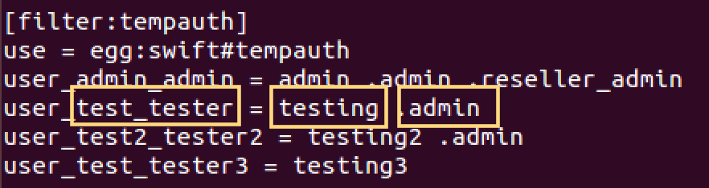
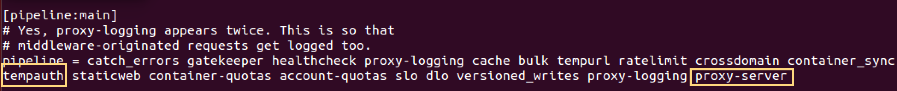

SAIO with Keystone Integration
==============================

Setting up Swift with SAIO
--------------------------

Devstack is the de facto starting point for developers who want to get started with Openstack. It is a shell script which deploys a minimal openstack on a single machine. We can deploy Swift using devstack, however, the cryptic nature of scripts keep us from understanding what’s happening under the hood.

`Swift All In One (SAIO) <http://docs.openstack.org/developer/swift/development_saio.html>`_ is the suggested way to deploy Swift on a single machine if you want to get familiar with the process. It is also preferred by Swift developers. If you follow along the documentation, you will end up with a machine emulating a four node swift cluster.

It assumes a single machine with Ubuntu 14.04 however, it provides alternative instructions for Fedora and CentOS. In order to emulate four nodes, it asks you to attach an additional storage device or use a loop-back device (filesystem on a file). If you’re setting swift up in a virtual machine, adding a device boils down to just a few clicks.

There is one bug in SAIO documentation. If you’re using Ubuntu 14.04 LTS, you need to update python-six and python-eventlet in order to pass the unit tests. Since these packages are managed by apt, they cannot be updated by pip and 14.04 LTS repository doesn’t support the required version. I had to hang out on swift’s IRC channel to figure out the problem and its solution.

In order to resolve this issue, run the following commands before running the unit-tests and you are good to go.

.. code-block:: shell
	
	sudo sh -c \ "echo 'deb http://archive.ubuntu.com/ubuntu/ /"\
	"vivid main restricted' > /etc/apt/sources.list.d/saio_sources.list"

	sudo sh -c "echo 'deb-src http://archive.ubuntu.com/ubuntu/ /"\
	"vivid main restricted' >> /etc/apt/sources.list.d/saio_sources.list"

	sudo apt-get update

	sudo apt-get install python-eventlet python-six python-six-whl

	sudo sed -i s/deb/#deb/g /etc/apt/sources.list.d/saio_sources.list

	sudo apt-get update

Authentication TempAuth
-----------------------

Swift comes with a lightweight authentication system called TempAuth. It is meant for trying out Swift and is easy to work with. However, it is not recommended to use TempAuth in production environments because of its limited capabilities.

If you have installed Swift using SAIO, you have already tried out TempAuth. In step 11 (SAIO), you typed in the following command to retrieve X-Storage-Url and X-Auth-Token from TempAuth.

.. code-block:: shell

	curl -v -H 'X-Storage-User: test:tester' \ 
	-H 'X-Storage-Pass: testing' http://127.0.0.1:8080/auth/v1.0

In the above command, you are passing test:tester as user, and testing as password to TempAuth to retrieve a token. Let’s see how TempAuth is configured with this username and password.

In /etc/swift/proxy-server.conf file, we have a filter for TempAuth as shown in the following screenshot. The fourth line, with yellow boxes represents the user **test:tester** with password **testing** and role **admin**. Any user not listed in this filter will not get authenticated.

It is worth mentioning that Swift uses TempAuth as a middleware. In fact, any authentication service we use with Swift would be a configured as a middleware intercepting requests to the Proxy Server. In /etc/swift/proxy-server.conf file, we can see TempAuth in the pipeline configuration.

The pipeline terminates with the service application we are configuring which is proxy-server in this case.

Authentication Keystone
-----------------------
Keystone is the official Openstack authentication solution that works across different projects in Openstack family. If you are using swift along with other projects in Openstack suite, Keystone is the recommend authentication system.

We will now set up Keystone and integrate.

.. code-block:: shell
   
   sudo apt-get install keystone

In order to use keystone, we need to provide a username and a password. Since, there is no user registered with keystone yet, we will bootstrap the process by setting up an **ADMIN_TOKEN** in keystone configuration file.

Creating a random token using **openssl**.

.. code-block:: shell

   openssl rand -hex 10

Replace **ADMIN_TOKEN** in /etc/keystone/keystone.conf file with the result of previous command.

.. code-block:: shell

   [DEFAULT]
   # A "shared secret" that can be used to bootstrap Keystone.
   admin_token = ADMIN_TOKEN
   ...

Restart keystone service for the changes to take effect.

.. code-block:: shell
   
   sudo service keystone restart

Now we can bootstrap keystone with **ADMIN_TOKEN**. We also need to specify where Identity service is running (end-point). By default, Keystone uses port 35357 and 5000. Port 35357 exposes admin-level API.

Let’s do a sanity check and **discover** keystone servers, supported API versions and extension using the **ADMIN_TOKEN** we just set.

.. code-block:: shell

   keystone --os-token ADMIN_TOKEN --os-endpoint http://localhost:35357/v2.0 discover

If you are using keystone client from a different machine than the one running keystone service, you can plug its IP address in place of **localhost** in the above command.

We can set OS_SERVICE_TOKEN and OS_SERVICE_ENDPOINT environment variables to make our lives easier while working with keystone.

.. code-block:: shell

   export OS_SERVICE_TOKEN=ADMIN_TOKEN
   export OS_SERVICE_ENDPOINT=http://localhost:35357/v2.0

Now we can discover simply by typing in:

.. code-block:: shell
   
   keystone discover

We will now create administrative user, tenant and role. 

.. code-block:: shell
   
   keystone user-create --name admin --pass ADMIN_PASS --email ADMIN_EMAIL
   keystone role-create --name admin
   keystone tenant-create --name admin --description "Admin Tenant"

Linking admin user, admin role and admin tenant.

.. code-block:: shell

   keystone user-role-add --user admin --tenant admin --role admin

By default, Keystone has a _member_ role. The Openstack dashboard automatically grants access to users with this role. We will assign admin user access to this role in addition to the admin role.

.. code-block:: shell

   keystone user-role-add --user admin --role _member_ --tenant admin

Openstack services also make use of each other's services. For example, Glance could make use of Swift for storing images, or Nova could use Glance for booting images. Thus, an Openstack service, just like an end-user, would require a username, tenant and role to access another Openstack service. Typically, Openstack services are grouped within a single tenant named **service**.

Creating a **service** tenant.

.. code-block:: shell

   keystone tenant-create --name service --description "Service Tenant"

Service Entry and API Endpoints
^^^^^^^^^^^^^^^^^^^^^^^^^^^^^^^
Identity service essentially performs two tasks.

* Track users, tenants and roles
* Provide service catalogs for various Openstack services and their API endpoints

**Since Keystone is a service itself, we need to register it along with its API endpoints in Keystone.**

Creating a service entry for Keystone. 

.. code-block:: shell

   keystone service-create --name keystone --type identity \
   --description "OpenStack Identity"
 
Attaching API endpoints to the service using its ID. We specify three endpoints for admin API, public API and internal API.

.. code-block:: shell

   keystone endpoint-create \
   --service-id= SERVICE_ID \
   --publicurl=http://localhost:5000/v2.0 \
   --internalurl=http://localhost:5000/v2.0 \
   --adminurl=http://localhost:35357/v2.0

Replace **SERVICE_ID** with the returned service ID when we created service entry for Keystone.
Trailing v2.0 in the URLs specify that API version 2.0 would be used for interactions.

Later in this document, we will add a service entry for Object Storage (Swift) along with its API endpoints. 

Verifying Keystone Installation
^^^^^^^^^^^^^^^^^^^^^^^^^^^^^^^

So far we have been bypassing authentication using the **ADMIN_TOKEN**. Now let’s take off the training wheels and use our newly created admin user to perform some tasks.

.. code-block:: shell

   unset OS_SERVICE_TOKEN OS_SERVICE_ENDPOINT

Requesting an authentication token using the admin user.

.. code-block:: shell
   
   keystone --os-username admin --os-password ADMIN_PASS \
   --os-auth-url http://localhost:35357/v2.0 token-get

We get an authentication token paired with User ID. This verifies that the user account is established with expected credentials.

We can also perform administrative tasks using the admin user. For example, retrieving list of users.

.. code-block:: shell

   keystone --os-username admin --os-password ADMIN_PASS \
   --os-auth-url http://localhost:35357/v2.0 user-list

Let’s set environment variables for admin credentials to make command line interactions simpler. Create an admin-openrc.sh file as follows.

.. code-block:: shell 
  
   export OS_USERNAME=admin
   export OS_PASSWORD=ADMIN_PASS
   export OS_TENANT_NAME=admin
   export OS_AUTH_URL=http://localhost:35357/v2.0

Source the file for environment variables to take effect.

.. code-block:: shell
   
   source admin-openrc.sh

Now retrieving user-list becomes a lot easier. Keystone client uses credentials of admin users behind the scenes.

.. code-block:: shell
  
   keystone user-list

We are all set with Identity service. We can now move on to integrate it with our SAIO deployment.

Integrating SAIO with Keystone
^^^^^^^^^^^^^^^^^^^^^^^^^^^^^^

Let’s create a user **swift** which will be used by Swift Object Storage (proxy-server) to authenticate with the Identity service. We will associate this user with **service** tenant and assign it **admin** role.

.. code-block:: shell

   keystone user-create --name swift --pass SWIFT_PASS \
   --email swift@example.com
   
   keystone user-role-add --user swift --tenant service --role admin

Replace **SWIFT_PASS** with the password of your choice. 

Creating a service entry for Swift Object Storage and attaching API endpoints to it using the service ID returned.

.. code-block:: shell  

   keystone service-create --name=swift --type=object-store \
   --description="OpenStack Object Storage"

   keystone endpoint-create \
   --service-id SERVICE_ID \
   --publicurl 'http://localhost:8080/v1/AUTH_%(tenant_id)s' \
   --internalurl 'http://localhost:8080/v1/AUTH_%(tenant_id)s' \
   --adminurl http://localhost:8080

Some key observations

* The URLs we have provided represent the proxy server since proxy server exposes Swift functionality to end users.
* AUTH\_ **tenant_id** is appended with each URL which represents an account in swift.

We will now configure proxy-server to use Keystone for authentication. In /etc/swift/proxy-server.conf file, make the following changes.

Replace **tempauth** in pipeline with authtoken **keystoneauth**.

I am copying pipeline configuration of my system here for your reference. I have marked authtoken and keystoneauth in bold.

.. code-block:: shell

   [pipeline:main]
   # Yes, proxy-logging appears twice. This is so that
   # middleware-originated requests get logged too.
   pipeline = catch_errors gatekeeper healthcheck proxy-logging cache bulk tempurl ratelimit crossdomain container_sync authtoken keystoneauth staticweb container-quotas account-quotas slo dlo versioned_writes proxy-logging proxy-server

Add configuration for authtoken and keystoneauth in /etc/swift/proxy-server.conf as following.

.. code-block:: shell
   
   [filter:authtoken]
   paste.filter_factory = keystoneclient.middleware.auth_token:filter_factory
   delay_auth_decision = true
   # auth_* settings refer to the Keystone server
   auth_protocol = http
   auth_host = localhost
   auth_port = 35357
   # the service tenant and swift username and password created in Keystone
   admin_tenant_name = service
   admin_user = swift
   admin_password = SWIFT_PASS

   [filter:keystoneauth]
   use = egg:swift#keystoneauth
   operator_roles = _member_,admin,swiftoperator

Replace **SWIFT_PASS** with the password you set while creating swift user. Note the swiftoperator role in keystoneauth’s configuration. We will assign swiftoperator role to non-admin users who want to use Swift.

Restart the proxy-server for the changes to take effect.

.. code-block:: shell

   sudo swift-init proxy restart

Verifying SAIO and Keystone Integration
^^^^^^^^^^^^^^^^^^^^^^^^^^^^^^^^^^^^^^^

Set up admin-openrc.sh file with credentials you want to use and source it. Since we have only added admin credentials yet, we will be using admin user in our interactions with swift.

.. code-block:: shell

   source admin-openrc.sh

We will use swift stat command to display information about the admin user’s account.

.. code-block:: shell
 
   swift stat

You should be getting a somewhat  similar output to the following.

.. code-block:: shell
	
   # Expected Output
   Account: AUTH_29b318f9f8ad45c9a76183da88fe3475
   Containers: 0
   Objects: 0
   Bytes: 0
   Content-Type: text/plain; charset=utf-8
   X-Timestamp: 1446220756.04903
   X-Trans-Id: tx673b4af199794e939f6a9-00563393d3
   X-Put-Timestamp: 1446220756.04903

Create a test.txt file and upload it to admin account in myfiles container. Swift will create myfiles container behind the scenes.

.. code-block:: shell

   swift upload myfiles test.txt

Create another test2.txt file and upload it.

.. code-block:: shell

   swift upload myfiles test2.txt

Download all files from myfiles container.

.. code-block:: shell
   
   swift download myfiles

.. code-block:: shell
   
   # Expected output
   test2.txt [auth 0.175s, headers 0.195s, total 0.195s, 0.000 MB/s]
   test.txt [auth 0.182s, headers 0.199s, total 0.199s, 0.000 MB/s]

We have successfully installed SAIO in a single VM and integrated it with Keystone. If we want to allow a non-admin user to access Swift, we can create a new user and tenant, and tie them with swiftoperator role. Don’t forget to update admin-openrc.sh files with the credentials of the new user. You could also pass the credentials as parameters to override the environmental variables.
